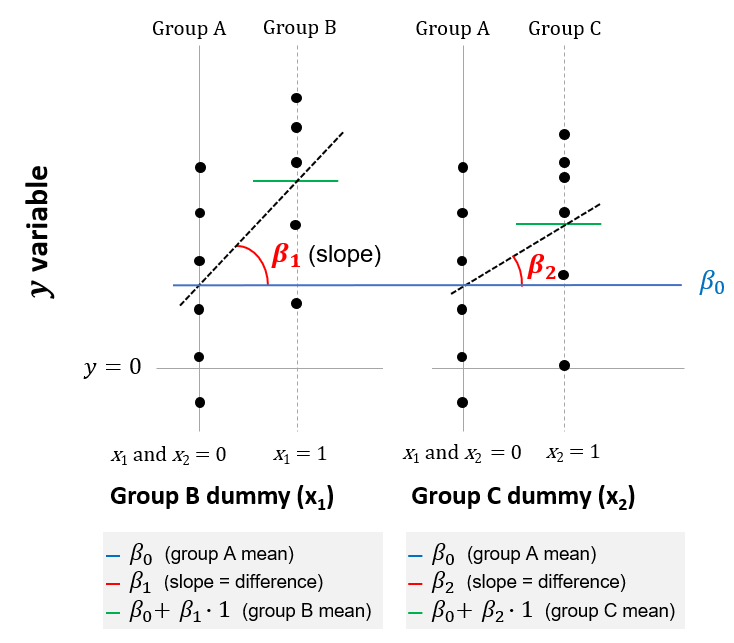

# Three or more means


## One-way ANOVA

The one-way analysis of variance (ANOVA) is used to determine whether there are any statistically significant differences between the means of three or more independent groups.

Examples include:

* Is there a difference in academic outcomes for pupils from ten different schools?
* Is there a difference daily coffee consumption between people in three different countries?

Intuitively, ANOVA is based on comparing the variance (or variation) between the groups, to variation
within each particular group. If the 'between' variation is much larger than the 'within' variation,
we are more likely to conclude that the means of the different groups are not equal. If the 'between' and 'within' variations are more similar in size, then we are less likely to conclude that there is a significant difference between sample means.

Why can't we just compare the means of every possible pair of groups, and see if any differences are statistically significant? The reason is that as the number of groups increases, the more likely we are to see differences that are due to chance alone. This means we are more likely to commit a Type I error, rejecting the null hypothesis (that there is no difference between the means) when the null hypothesis is in fact true.^[For example, if there were only two groups, we would be carrying out one comparison: the mean of Group A vs the mean of Group B. At a 0.05 level of significance, there would be a 5% chance of a Type I error. If we had three groups, there would be three comparisons (Group A vs Group B, Group A vs Group C, and Group B vs Group C), and we would have a 14.3% (1-0.95^3) chance of a Type I error.] An ANOVA controls for this additional risk of Type I errors, maintaining the overall or experimentwise error rate, which is typically $\alpha$ = 0.05.

It is important to note that the one-way ANOVA is an omnibus test statistic and cannot tell you _which_ specific groups were statistically significantly different from each other, only that at least two groups were different. To determine which specific groups differed from each other, you would need to use a post hoc test.^[Post hoc tests attempt to control the experimentwise error rate (usually $\alpha$ = 0.05) in the same manner that the one-way ANOVA is used instead of multiple t-tests. [Laerd](https://statistics.laerd.com/statistical-guides/one-way-anova-statistical-guide-4.php) suggests using the Tukey test (where there is homogeneity of variances in your samples) or the Games Howell test (where there is not).]

__Dataset:__

To illustrate, we will create a new dataset (`mydata_anova1`). We assume three groups (A, B and C) of normally-distributed variables, with means of 0, 1 and 0.5 respectively. We also create dummy variables for groups B and C (group A is our reference group, and so does not require an indicator):

```{r}
# Create dataset 'mydata_anova1' which is three groups:
set.seed(40)                      # Makes the randomised figures reproducible
n <- 20                           # Sample size of 20 for each group
mydata_anova1 <- data.frame(
                    value = c(rnorm_fixed(n, mu = 0, sd = 1),     # Group A
                              rnorm_fixed(n, mu = 1, sd = 1),    # Group B
                              rnorm_fixed(n, mu = 0.5, sd = 1)), # Group C
                    group = rep(c("a", "b", "c"), each = N)
                    ) %>%
  # Explicitly add indicator/dummy variables
  mutate(group_b = if_else(group == "b", 1, 0)) %>%             # Group B dummy
  mutate(group_c = if_else(group == "c", 1, 0))                 # Group C dummy

```

Here’s a sample of six rows from our new dataset, which includes the dummy variables:

```{r, echo = FALSE}
knitr::kable(
  (mydata_anova1[c(1, 2, 21, 22, 41, 42), ] %>% arrange(group)),
  caption = "Some randomly selected rows from our dataset",
  booktabs = TRUE)
```

Note that the data used in the remainder of this book varies from that used by Lindeløv in the original version, but the principles being discussed are exactly the same.

__ANOVA function:__

R has a package for ANOVA, in this case `car::Anova(aov())`. However, this is simply a 'wrapper' around the equivalent linear model, described below, and yields identical results.

__Equivalent linear model:__

The linear model assumes that the dependent variable can be predicted with a single mean for each group:

$y = \beta_0 + \beta_1 \cdot x_1 + \beta_2 \cdot x_2 + ... \qquad  H_0: y = \beta_0$

This assumption is illustrated below, in which there are assumed to be three groups (A, B and C). This extends the case with two groups, as was illustrated in the previous chapter, to cases with three or more groups. In this case, members of group B are identified by the dummy variable $x_1$, with the coefficient (or slope) of $\beta_1$, and members of group C are identified by the variable $x_2$, with the slope of $\beta_2$.


```{r dummy3, echo = FALSE, fig.cap = "Linear model equivalent to ANOVA with three groups", out.width = "75%", fig.align = "center"}

```

The null hypothesis of the linear model is that $\beta_1$ and $\beta_2$ are both zero; or equivalently, that all groups have the same mean of $\beta_0$. To test this hypothesis, an [F-test](https://www.statisticshowto.datasciencecentral.com/probability-and-statistics/f-statistic-value-test/) is used. The F statistic in a regression is the result of a test where the null hypothesis is that all of the regression coefficients are equal to zero. The F-test compares your full model to one with no predictor variables (the intercept only model), and decides whether your added variables improved the model. If you get a significant result, then whatever coefficients you included in your full model improved the model’s fit (beyond what could be expected by chance alone).

In R, an F-test is carried out every time you run a linear regression, i.e. you do not have to specify it as an additional test.

__Comparison:__

The following code compares the ANOVA test in R with the identical linear model using dummy variables:

```{r, eval = FALSE}
# Anova
car::Anova(aov(value ~ group, data = mydata_anova1))

# Linear model
lm <- lm(value ~ 1 + group_b + group_c, data = mydata_anova1)
  lm %>% summary() %>% print(digits = 8) # show summary output

```

Here are the results, which are identical:

```{r, echo = FALSE}
knitr::kable(
  tribble(
    ~Test, ~"df", ~"df.residual", ~F.statistic, ~p.value,
    "Anova", 2, 57, 5, 0.00998,
    "lm", 2, 57, 5, 0.00998
    ),
  caption = "One-way ANOVA and equivalent linear model",
  booktabs = TRUE
)
```

Here we would reject the null hypothesis that there was no differences between the means of any of our groups at the 0.05 level of significance (because p = 0.00998).

It should be emphasised that the results of the ANOVA and the linear model are identical _by construction_, as they are both an F-test that compares the full model (with group dummies) to a model with an intercept only.

### Kruskal-Wallis

The non-parametric version of the ANOVA is the Kruskal-Wallis test. We would need to use this test if our dependent variable was ordinal rather than continuous. We would also use the non-parametric version if other assumptions of the one-way ANOVA did not hold, including (1) that the dependent variable was approximately normally distributed for each category of the independent variable, and (2) homogeneity of variances.

__Equivalent linear model:__

The Kruskal-Wallis is essentially a one-way ANOVA test on __ranks__. It can be expressed as the following linear model:


$rank(y) = \beta_0 + \beta_1 \cdot x_1 + \beta_2 \cdot x_2 + ... \qquad  H_0: y = \beta_0$


__Comparison:__

Here is a comparison of the Kruskal-Wallis test and the equivalent linear model (the equivalent ANOVA test is also included for completeness, which we've seen is just a 'wrap' around the linear model).

```{r, eval = FALSE}
# Kruskal-Wallis
kruskal.test(value ~ group, data = mydata_anova1)

# Linear model on ranks
lm <- lm(rank(value) ~ 1 + group_b + group_c, data = mydata_anova1)
  lm %>% summary() %>% print(digits = 8) # show summary output

# Anova on ranks (which is a wrapper around the linear model above)
car::Anova(aov(rank(value) ~ group, data = mydata_anova1))

```

```{r, echo = FALSE}
knitr::kable(
  tribble(
    ~Test, ~"df", ~p.value,
    "Kruskal", 2, 0.0203,
    "lm", 2, 0.0177
    ),
  caption = "Kruskal-Wallis test and equivalent linear model",
  booktabs = TRUE
)
```

The p-value of the two tests are similar, though not identical. In this example, we would reject the null hypothesis that all groups had equal means (at the 0.05 level of significance).


## Two-way ANOVA

The two-way ANOVA compares the means of groups that have been split on two independent variables, or 'factors'.

For example: is there an interaction between gender and educational level on test anxiety among university students? Here gender (males / females) and education level (high school / undergraduate / postgraduate) are your independent variables or factors.

A two-way ANOVA tests three hypotheses:

* That the population means of the first factor (e.g. each gender) are equal;
* That the population means of the second factor (e.g. each education level) are equal; and
* That there is no interaction between the two factors - i.e. that the relationship between anxiety and gender does not depend on education level, or that the relationship between anxiety and education does not depend on gender.

The first two hypotheses relate to the relationship between each factor and the dependent variable, referred to as 'main effects'. Each of these is like a one-way ANOVA, but in the context of a larger model. The third hypothesis relates to the 'interaction effect'. Here we will focus on the interaction effect.

__Updated dataset:__

To show the modelling in R, we'll add another factor to our example dataset, `mood`, which reports whether a person is happy or sad. We also use this to create a dummy variable, `mood_happy`, which takes the value of 1 if the person is happy or 0 if they are sad.

```{r}
mydata_anova2 <- mydata_anova1 %>%
  # 60 observations in total
  mutate(mood = rep(c("happy", "sad"), 30)) %>% 
  # The dummy variable
  mutate(mood_happy = if_else(mood == "happy", 1, 0))
```

Here's a selection of six rows from the updated dataset:
```{r, echo = FALSE}
knitr::kable(
  (mydata_anova2[c(1, 2, 21, 22, 41, 42), ] %>%
    arrange(group)),
  caption = "Some randomly selected rows from our dataset",
  booktabs = TRUE)
```

__Equivalent linear model:__

The two-way ANOVA can test for the interaction between two factors (let's ignore the main effects for now). It is equivalent to the following linear model, which is now expressed using matrix notation:

::: {.center data-latex=""}

$y = \beta_0 + \beta_1 X_1 + \beta_2 X_2 + \beta_3 X_2  X_3 \qquad  H_0: \beta_3 = 0$

:::

Here $X_1$ and $X_2$ represent the two factors in our model (in this example, the 'group' and 'mood' of each observation, respectively). Each $\beta_i$ is a vector of values that relates to the levels within each factor. In our example, $\beta_1$ will have two values that correspond to the group dummy variables (`group_b` and `group_c`) and $\beta_2$ will be single value corresponding to the dummy variable for mood (`mood_happy`). The intercept $\beta_0$, to which all other $\beta$s are relative, is now the mean for the first level of all factors (people in group A who are sad).

$\beta_3$ is a vector that relates to the interactions of the factors. Here, it will be a vector comprising two values, corresponding to the combinations of the group and mood dummy variables (`group_b` and `mood_happy`, and `group_c` and `mood_happy`). The null hypothesis (of $\beta_3 = 0$) is that all values in this vector are zero, and that there is no interaction between group and mood when explaining the dependent variable, `value`.

To test this null hypothesis, we are going to carry out an F-test of two nested models:

* a full model, which includes both factors and the interaction terms; and
* a restricted or null model, which includes both factors but no interaction term.

This is similar to the F-test used in the one-way ANOVA above, but in this case our null model includes the two factors and not just an intercept term.

__Comparison:__

The code for running the ANOVA, using the package in R, is as follows:

```{r, eval = FALSE}
# Two-way ANOVA, built-in function
car::Anova(aov(value ~ mood + group + mood:group, data = mydata_anova2))
```

The equivalent linear model, which includes an interaction between the two group dummy variables and the mood dummy variable, is specified as follows:

```{r, eval = FALSE}
lm(value ~ 1 + group_b + group_c + mood_happy +
           group_b:mood_happy + group_c:mood_happy,
        data = mydata_anova2)
```

The results of the above model will give us the p-values of _all_ the interaction terms (in this case, two) and tell us if any of these are statistically significant. But recall that our null hypothesis is that _none_ of the interaction terms are significant, and we can't rely on individual tests for this because of the increased risk of errors (as explained in the  previous section on one-way ANOVAs). This is why we use the two-way ANOVA, which is an F-test that compares the full and null models:

```{r, eval = FALSE}
# null model, without interactions
null <- lm(value ~ 1 + group_b + group_c + mood_happy, data = mydata_anova2)

# full model, with interactions
full <- lm(value ~ 1 + group_b + group_c + mood_happy + group_b:mood_happy +
             group_c:mood_happy, data = mydata_anova2)

# ANOVA using the two models above.
anova(null, full, test = "F")    # anova() uses an F test by default,
                                # but here it's made explicit
```

The results of the two approaches are presented in the table below. This shows that the two approaches are identical F-tests with the same resulting p-value.

```{r, echo = FALSE}
knitr::kable(
  tribble(
    ~Test, ~df, ~df.res, ~F.value, ~p.value,
    "ANOVA", 2, 54, 0.2977, 0.7437,
    "lm", 2, 54, 0.2977, 0.7437
    ),
  caption = "Two-way ANOVA and equivalent linear model",
  booktabs = TRUE
)
```

On this basis of the test above, we would fail to reject the null hypothesis that there was no interaction between the two factors in our model (group and mood), at the 0.05 level of significance.

## ANCOVA

This adds a _continuous_ independent variable, or covariate, to the model (e.g. age), in addition to one or more categorical independent variables (e.g. gender or education level).

An analysis of covariance (ANCOVA) evaluates whether the mean of the dependent variable is equal across levels of a categorical independent variable, while statistically controlling for the effects of other continuous variables (e.g. age) that are not of primary interest, known as covariates.

__Updated dataset:__

Here will will add a covariate to our one-way ANOVA above. In addition to the `group` dummy variables, we update our data set to include each subject's `age`, which we assume is correlated with the dependent variable, `value`:

```{r}
# create a new column with the continuous variable 'age'
mydata_anova3 <- mydata_anova1 %>%
  mutate(age = value + rnorm_fixed(nrow(.), sd = 3))
```

Here's a selection of six rows from the updated dataset:

```{r, echo = FALSE}
knitr::kable(
  (mydata_anova3[c(1, 2, 21, 22, 41, 42), ] %>% arrange(group)),
  caption = "Some randomly selected rows from our dataset",
  booktabs = TRUE)
```

__ANOVA function:__

An ANCOVA can be carried out using the `Anova()` function and including the covariate (in this case `age`) as an independent variable.

```{r, eval = FALSE}
car::Anova(aov(value ~ group + age, mydata_anova3))
```

__Equivalent linear model:__

The same results can be achieved by using F-tests to compare two sets of linear models: (i) the full model and the nested model which excludes `age`, and (ii) the full model and the nested model that excludes the `group` dummy variables. Again, the F-tests are carried out using the `anova()` function, which uses an F-test by default.

The full model can be formulated as follows:

::: {.center data-latex=""}

$y = \beta_0 + \beta_1 \cdot x_1 + \beta_2 \cdot x_2 + ... + \beta_3 \cdot age$

:::

where the value of $y$ varies by group, as represented here by the dummy variables $x_1$ and $x_2$, and also by $age$.

This can be illustrated below. The ANCOVA tests whether there is difference in the mean `y` for the three groups, after controlling for age (the vertical shift shown by $\beta_1$ and $\beta_2$). It also tests whether the slope $(\beta_3)$ is statistically significant.

```{r, echo = FALSE, fig.cap = "Linear model equivalent to ANCOVA with three groups", out.width = "75%", fig.align = "center"}
knitr::include_graphics("images/image_ancova.png")
```

Here we run the linear model in R. The resulting p-values relate to the null hypotheses that `age` and `group` (respectively) have no effect on the dependent variable, in this case `value`.

```{r, eval = FALSE}
# full model, with group and age variables
full <- lm(value ~ 1 + group_b + group_c + age, mydata_anova3)
# model without age
null_age <- lm(value ~ 1 + group_b + group_c, mydata_anova3)
# model without groups
null_group <- lm(value ~ 1 + age, mydata_anova3)
# result for age
anova(null_age, full)
# results of group
anova(null_group, full)
```

__Comparison:__

The results of the two approaches are presented in the table below:

```{r, echo = FALSE}
knitr::kable(
  tribble(
    ~Term, ~Model, ~df, ~res.df, ~F.value, ~p.value,
    "age", "Anova", 1, NA, 5.2002, 0.02641,
    "age", "lm", 1, 56, 5.2002, 0.02641,
    "group", "Anova", 2, NA, 4.6929, 0.01305,
    "group", "lm", 2, 56, 4.6929, 0.01305
    ),
  caption = "ANCOVA and linear model",
  booktabs = TRUE
)
```

Based on these results, we would reject the null hypothesis that there was no relationship between `value` and `group`, even after controlling for differences in `age`. We would also reject the null hypothesis that `value` was not related to `age`.